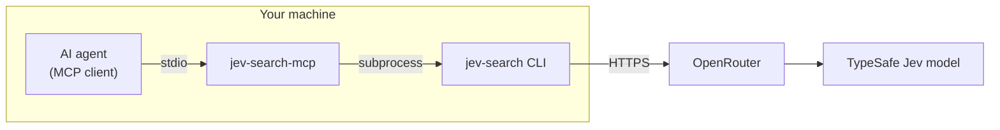

<div align="center">

# jev-search-mcp

**Find by meaning what keywords miss — as an MCP tool for your agents.**

[](LICENSE)
[](https://www.python.org/)
[](https://modelcontextprotocol.io/)
[](https://github.com/Vento741/jev-search-mcp/actions/workflows/ci.yml)

**English** · [Русский](README.ru.md)

</div>

`grep` finds the words you typed. `jev_search` finds the lines that *mean* what you asked, even when they use different words.
This is a small stdio MCP server that gives any MCP-capable agent the [jev-search](https://github.com/larguesa/jev-search) CLI as one tool: `jev_search`.

## What it is

- **Complementary semantic line search.** Every nonblank line of a few small text files is judged against your intent by the TypeSafe Jev model. It adds to lexical search; it does not replace it.
- **Runs locally, next to your files.** The server is a local process that your client starts over stdio. There is no port to open and nothing to host; only the model call itself is remote.
- **Works with every client that speaks MCP.** Claude Code, Claude Desktop, OpenCode, or any other stdio MCP client.

## How it works



The agent calls `jev_search` with a query and 1–8 absolute file paths. The server runs the pinned `jev-search` CLI, which reads the files, sends the nonblank lines and the query in **one** request, and returns a score for every line. The agent then merges these matches with its exact-search hits and reads the original context.

> [!NOTE]
> **Why complement grep?** In the upstream author's exploratory [evaluation](https://github.com/larguesa/jev-search/blob/main/tests/REPORT.md), across six simulated tasks, lexical search plus Jev recovered 29 of 34 labeled relevant passages, compared with 22 of 34 for lexical search alone. These were small, manually curated experiments, not a general accuracy claim.

## Quick start

**Requirements:** [uv](https://docs.astral.sh/uv/) and [git](https://git-scm.com/downloads).

**1. Install uv** (skip this if `uv --version` already works), then open a new terminal.

```powershell
# Windows (PowerShell)
powershell -ExecutionPolicy ByPass -c "irm https://astral.sh/uv/install.ps1 | iex"
```

```bash
# Linux / macOS
curl -LsSf https://astral.sh/uv/install.sh | sh
```

**2. Set your key.** Create your **own** OpenRouter key with a spending limit at <https://openrouter.ai/settings/keys> and store it as `JEV_SEARCH_API_KEY`.

```powershell
# Windows (PowerShell): paste the key when asked, then fully restart your terminal and MCP client
$s = Read-Host 'Paste your OpenRouter key' -AsSecureString
[Environment]::SetEnvironmentVariable('JEV_SEARCH_API_KEY', [System.Net.NetworkCredential]::new('', $s).Password, 'User')
```

```bash
# Linux / VPS (bash): paste the key when asked; it is not shown and stays out of shell history
read -rsp 'Paste your OpenRouter key: ' K; echo
echo "export JEV_SEARCH_API_KEY='$K'" >> ~/.bashrc; unset K; chmod 600 ~/.bashrc; source ~/.bashrc
```

Use `~/.bashrc`, because `~/.profile` alone misses non-login shells. This covers interactive shells only; for services or non-interactive launches, put the key in the client's `env` block. On macOS (zsh), run the same lines with `read -rs 'K?Paste your OpenRouter key: '` and `~/.zshrc`.

**3. Install and connect** (the example uses Claude Code; other clients are covered [below](#connect-your-client)).

```bash
uv tool install git+https://github.com/Vento741/jev-search-mcp@v0.1.1
jev-search-mcp --version   # prints 0.1.1
claude mcp add --scope user jev-search -- jev-search-mcp
```

Using OpenCode instead? Run `opencode mcp add --global jev-search -- jev-search-mcp` and then `opencode reload` (see [OpenCode](#opencode)).

To check the setup for free, ask your agent: *"Run jev_search with dry_run on /home/me/notes/sample.txt for 'greeting'"* (use the absolute path of one of your own files, e.g. `C:\Users\you\notes\sample.txt` on Windows).

> [!TIP]
> If the shell reports that `jev-search-mcp` is not found, run `uv tool update-shell` and open a new terminal.

<details>
<summary><b>Update or uninstall</b></summary>

```bash
# update to a newer release tag
uv tool install --force git+https://github.com/Vento741/jev-search-mcp@<new-tag>
# remove
uv tool uninstall jev-search-mcp
```

</details>

## Connect your client

The server itself never takes a key as an argument; it reads `JEV_SEARCH_API_KEY` from the environment its client gives it. Clients differ in what environment they pass on, which determines where the key has to go.

### Claude Code

```bash
claude mcp add --scope user jev-search -- jev-search-mcp
```

Claude Code passes its whole environment to stdio servers, so the user variable from step 2 is enough. If you set the variable after starting Claude Code, fully restart it. With `--scope user`, the server is available in all your projects.

### Claude Desktop

Claude Desktop passes only a small default set of variables (such as `PATH` and `APPDATA`) to servers, **not** your user variables. The key must therefore go into the config's `env` block, and `command` must be the full path to the executable.

1. Find the path: `where.exe jev-search-mcp` (Windows) or `which jev-search-mcp` (macOS/Linux).
2. Open the config file. You can use *Settings → Developer → Edit Config*, or open it directly at `%APPDATA%\Claude\claude_desktop_config.json` (Windows).
3. Add the server (merge it into `mcpServers` if the file already has one), then fully quit and reopen Claude Desktop.

```json
{
  "mcpServers": {
    "jev-search": {
      "command": "C:\\Users\\you\\.local\\bin\\jev-search-mcp.exe",
      "env": { "JEV_SEARCH_API_KEY": "<your-key>" }
    }
  }
}
```

<details>
<summary><b>macOS config</b></summary>

File: `~/Library/Application Support/Claude/claude_desktop_config.json`

```json
{
  "mcpServers": {
    "jev-search": {
      "command": "/Users/you/.local/bin/jev-search-mcp",
      "env": { "JEV_SEARCH_API_KEY": "<your-key>" }
    }
  }
}
```

CI covers only Windows and Linux; macOS is expected to work but is not tested.

</details>

> [!WARNING]
> In this file the key is stored as **plain text**. It lives in your user profile, so keep it private: never commit, sync, or share it.

### OpenCode

```bash
opencode mcp add --global jev-search -- jev-search-mcp
opencode reload      # the OpenCode app runs a background service that caches its config
opencode mcp list    # expect: jev-search  connected
```

OpenCode passes your environment to local servers, so the user variable from step 2 is enough (checked with OpenCode 2.0 on Windows). `--global` writes to `~/.config/opencode/opencode.jsonc` and makes the server available in all projects; without it the server goes into the current project's `opencode.json`. If you set the key after OpenCode started, restart its background service with `opencode service restart` (or fully quit and reopen the app).

<details>
<summary><b>Resulting OpenCode config</b></summary>

```json
{
  "mcp": {
    "servers": {
      "jev-search": {
        "type": "local",
        "command": ["jev-search-mcp"]
      }
    }
  }
}
```

If OpenCode is started by a service that does not have your variables, add `"environment": { "JEV_SEARCH_API_KEY": "<your-key>" }` to the server entry (plaintext, same warning as for Claude Desktop). Do not pass the key with `opencode mcp add --env`: it would end up in your shell history.

</details>

### Any other MCP client

Use the generic stdio configuration. The same rule applies: unless your client is documented to pass on your full environment, put the key in `env`.

```json
{
  "mcpServers": {
    "jev-search": {
      "command": "jev-search-mcp",
      "args": [],
      "env": { "JEV_SEARCH_API_KEY": "<your-key>" }
    }
  }
}
```

**Zero-install alternative.** To run without `uv tool install`, use `uvx` as the command. It starts more slowly and may contact GitHub each time it starts.

```bash
uvx --from git+https://github.com/Vento741/jev-search-mcp@v0.1.1 jev-search-mcp
```

In JSON this is `"command": "uvx"` with `"args": ["--from", "git+https://github.com/Vento741/jev-search-mcp@v0.1.1", "jev-search-mcp"]`. In Claude Code, use `claude mcp add --scope user jev-search -- uvx --from git+https://github.com/Vento741/jev-search-mcp@v0.1.1 jev-search-mcp`.

<details>
<summary><b>Optional: TypeSafe directly or another model</b></summary>

| Variable | Values | Default |
|---|---|---|
| `JEV_SEARCH_PROVIDER` | `openrouter` or `typesafe` | `openrouter` |
| `JEV_SEARCH_MODEL` | model identifier | `typesafe/jev-1.13` (OpenRouter), `jev-1.13.0` (TypeSafe) |

Calling TypeSafe directly (`JEV_SEARCH_PROVIDER=typesafe`) requires a key issued by TypeSafe. OpenRouter and TypeSafe keys are **not interchangeable**. Set these variables the same way as the key, either in your environment or in the client's `env` block.

</details>

## Tool

The server is named `jev-search` and exposes one read-only tool.

**`jev_search(query, files, top_k=None, dry_run=False)`**

| Parameter | Type | Rules |
|---|---|---|
| `query` | string | Required. The intent to find, in natural language. At most 512 bytes (UTF-8), one line, with nothing that looks like a secret. |
| `files` | list of strings | Required. 1–8 **absolute** paths to UTF-8 `.txt`, `.md`, `.csv`, `.jsonl` or `.log` files. Directories and globs are not accepted. Relative paths fail with `files must be absolute paths ...`. |
| `top_k` | integer or null | Optional, 1–64. Also returns `ranked_results`: up to *k* matches sorted by score. `results` stays complete either way. |
| `dry_run` | boolean | Default `false`. A free, offline preview of exactly what would be sent. No key and no network are needed. |

**Example call**

```json
{ "query": "greeting", "files": ["/home/me/notes/sample.txt"], "dry_run": true }
```

**Dry-run output**, for a two-line file:

```json
{
  "mode": "dry-run",
  "requests": 1,
  "payload_bytes": 984,
  "rows": [
    { "file": "/home/me/notes/sample.txt", "line": 1, "original": "Hello, nice to meet you." },
    { "file": "/home/me/notes/sample.txt", "line": 2, "original": "The invoice is due Friday." }
  ],
  "unjudged": { "reason": "dry-run", "candidates": ["l0", "l1"] },
  "model": "typesafe/jev-1.13",
  "provider": "openrouter"
}
```

**Real search** (`dry_run: false`), measured 2026-09-30 through this MCP server; scores vary slightly between runs. Call:

```json
{ "query": "greeting", "files": ["/home/me/notes/sample.txt"], "top_k": 3 }
```

Output (file path synthetic, generation id truncated):

```json
{
  "mode": "sent",
  "latency_seconds": 0.94,
  "results": [
    { "file": "/home/me/notes/sample.txt", "line": 1, "original": "Hello, nice to meet you.", "probability": 0.8, "match": true },
    { "file": "/home/me/notes/sample.txt", "line": 2, "original": "The invoice is due Friday.", "probability": 0.04, "match": false }
  ],
  "ranked_results": [
    { "file": "/home/me/notes/sample.txt", "line": 1, "original": "Hello, nice to meet you.", "probability": 0.8, "match": true }
  ],
  "meta": {
    "model": "typesafe/jev-1.13-20260917",
    "generation_id": "gen-...",
    "cost": 1.953e-05,
    "input_tokens": 465,
    "output_tokens": 38
  }
}
```

`results` contains **every** nonblank line with its file, 1-based line number and score, and `match` is `probability >= 0.5`. The scores are useful for ordering, but they are not calibrated probabilities, so cite files and lines rather than numbers. With `top_k`, an extra `ranked_results` list holds only the matches, best first.

## Limits

These limits come from the upstream CLI, which deliberately works on small, reviewed context. It does not scan or truncate anything implicitly.

| Limit | Value |
|---|---|
| Files per call | 1–8, absolute paths, no directories or globs |
| File types | `.txt` `.md` `.csv` `.jsonl` `.log`, UTF-8 text |
| Combined size | ≤ 16 KB (16,384 bytes) **and** ≤ 64 lines across all files |
| Line length | ≤ 2 KB (2,048 bytes) per line |
| Query | ≤ 512 bytes |
| Requests | exactly one per call, **no retries** |
| Timeout | 330 s per call, set by this wrapper around the CLI subprocess (the CLI's own network timeout is 300 s) |

For a bigger file, search a reviewed excerpt of it instead. The CLI also rejects symlinks, paths where any component starts with `.` or contains `secret`, `credential`, `password` or `id_rsa`, and text that looks like a key or password.

## Privacy & cost

> [!IMPORTANT]
> **Your lines leave your machine.** Every selected nonblank line, plus the query, is sent to OpenRouter and on to TypeSafe. On the default route, the request pins TypeSafe as the only provider, with fallbacks disabled and `data_collection: deny`. Only send content you are allowed to share.

- **Real searches cost money.** A two-line search cost about **$0.00002** (measured 2026-09-30; prices vary). The cost grows with the number of lines.
- **Use your own key with a spending limit** set in the provider's dashboard. Never share it.
- **A missing `cost` does not mean the search was free.** A timeout or network failure may still have been charged. Nothing is ever retried automatically.
- `dry_run` is always free and never touches the network.

## Documentation

For detailed scenarios (notes and docs, log triage on a VPS, CSV tickets, combining grep with semantic search, working within the limits), key management and troubleshooting, see the **[detailed guide](docs/GUIDE.md)** (in Russian).

## Credits & license

- Built on **[larguesa/jev-search](https://github.com/larguesa/jev-search)** by Ricardo Pupo Larguesa (MIT), pinned to commit [`8aa4035`](https://github.com/larguesa/jev-search/commit/8aa403554d7904d3c14224cfda02a4e2144c0ccd).
- Inspired by **[uehaj/jev-semgrep](https://github.com/uehaj/jev-semgrep)**.
- This wrapper: [MIT](LICENSE) © 2026 Vento741.

Not affiliated with TypeSafe or OpenRouter.
