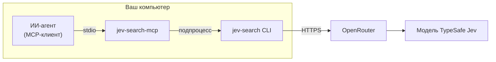

<div align="center">

# jev-search-mcp

**Находит по смыслу то, что пропускает поиск по словам, — в виде MCP-инструмента для ваших агентов.**

[](LICENSE)
[](https://www.python.org/)
[](https://modelcontextprotocol.io/)
[](https://github.com/Vento741/jev-search-mcp/actions/workflows/ci.yml)

[English](README.md) · **Русский**

</div>

`grep` находит слова, которые вы ввели, а `jev_search` находит строки, которые *означают* то, что вы ищете, даже если написаны другими словами.
Это небольшой stdio MCP-сервер. Он даёт любому агенту с поддержкой MCP инструмент `jev_search`, который работает через CLI [jev-search](https://github.com/larguesa/jev-search).

## Что это

- **Дополнительный смысловой поиск по строкам.** Модель TypeSafe Jev оценивает каждую непустую строку нескольких небольших текстовых файлов: выражает ли она ваше намерение. Этот поиск дополняет обычный, но не заменяет его.
- **Работает локально, рядом с вашими файлами.** Сервер — это локальный процесс, который клиент запускает через stdio. Не нужно открывать порты и ничего разворачивать; удалённо выполняется только сам вызов модели.
- **Подходит для любого клиента с поддержкой MCP**: Claude Code, Claude Desktop и других stdio-клиентов.

## Как это работает



Агент вызывает `jev_search`, передавая запрос и от 1 до 8 абсолютных путей к файлам. Сервер запускает закреплённую версию CLI `jev-search`. CLI читает файлы, отправляет непустые строки вместе с запросом **одним** запросом и возвращает оценку для каждой строки. Затем агент объединяет эти совпадения с результатами точного поиска и читает исходный контекст.

> [!NOTE]
> **Зачем дополнять grep?** Автор jev-search провёл предварительную [оценку](https://github.com/larguesa/jev-search/blob/main/tests/REPORT.md) на шести смоделированных задачах. Лексический поиск вместе с Jev нашёл 29 из 34 размеченных релевантных фрагментов, а один лексический — 22 из 34. Эксперименты были небольшими и подобраны вручную, поэтому это не общая оценка точности.

## Быстрый старт

**Нужны:** [uv](https://docs.astral.sh/uv/) и [git](https://git-scm.com/downloads).

**1. Установите uv** (если `uv --version` уже работает, пропустите этот шаг), затем откройте новый терминал.

```powershell
# Windows (PowerShell)
powershell -ExecutionPolicy ByPass -c "irm https://astral.sh/uv/install.ps1 | iex"
```

```bash
# Linux / macOS
curl -LsSf https://astral.sh/uv/install.sh | sh
```

**2. Задайте ключ.** Создайте **собственный** ключ OpenRouter с лимитом расходов на <https://openrouter.ai/settings/keys> и сохраните его в переменной `JEV_SEARCH_API_KEY`.

```powershell
# Windows (PowerShell): вставьте ключ по запросу, затем полностью перезапустите терминал и MCP-клиент
$s = Read-Host 'Вставьте ключ OpenRouter' -AsSecureString
[Environment]::SetEnvironmentVariable('JEV_SEARCH_API_KEY', [System.Net.NetworkCredential]::new('', $s).Password, 'User')
```

```bash
# Linux / VPS (bash): вставьте ключ по запросу; он не отображается и не попадает в историю команд
read -rsp 'Вставьте ключ OpenRouter: ' K; echo
echo "export JEV_SEARCH_API_KEY='$K'" >> ~/.bashrc; unset K; chmod 600 ~/.bashrc; source ~/.bashrc
```

Нужен именно `~/.bashrc`: оболочки без входа в систему не читают `~/.profile`. Так ключ увидят только интерактивные оболочки; для служб и неинтерактивного запуска укажите ключ в блоке `env` клиента. На macOS (zsh) выполните те же строки, но с `read -rs 'K?Вставьте ключ OpenRouter: '` и `~/.zshrc`.

**3. Установите сервер и подключите его** (в примере — Claude Code; про другие клиенты рассказано [ниже](#подключение-клиента)).

```bash
uv tool install git+https://github.com/Vento741/jev-search-mcp@v0.1.0
jev-search-mcp --version   # выведет 0.1.0
claude mcp add --scope user jev-search -- jev-search-mcp
```

Чтобы бесплатно проверить настройку, попросите агента: *«Запусти jev_search с dry_run для файла /home/me/notes/sample.txt и запроса „приветствие“»*. Укажите абсолютный путь к любому своему файлу, например `C:\Users\you\notes\sample.txt` в Windows.

> [!TIP]
> Если оболочка не находит `jev-search-mcp`, выполните `uv tool update-shell` и откройте новый терминал.

<details>
<summary><b>Обновление и удаление</b></summary>

```bash
# обновить до нового тега релиза
uv tool install --force git+https://github.com/Vento741/jev-search-mcp@<новый-тег>
# удалить
uv tool uninstall jev-search-mcp
```

</details>

## Подключение клиента

Сервер никогда не принимает ключ в аргументах: он берёт `JEV_SEARCH_API_KEY` из окружения, которое ему передаёт клиент. Разные клиенты передают разное окружение, поэтому место для ключа зависит от клиента.

### Claude Code

```bash
claude mcp add --scope user jev-search -- jev-search-mcp
```

Claude Code передаёт stdio-серверам всё своё окружение, поэтому пользовательской переменной из шага 2 достаточно. Если вы задали переменную, когда Claude Code уже работал, полностью перезапустите его. С `--scope user` сервер доступен во всех ваших проектах.

### Claude Desktop

Claude Desktop передаёт серверам только небольшой набор стандартных переменных (например, `PATH` и `APPDATA`), а ваши пользовательские переменные **не передаёт**. Поэтому ключ нужно указать в блоке `env` конфига, а в `command` — полный путь к исполняемому файлу.

1. Узнайте путь: `where.exe jev-search-mcp` (Windows) или `which jev-search-mcp` (macOS/Linux).
2. Откройте файл конфигурации. Это можно сделать через *Settings → Developer → Edit Config* или напрямую: `%APPDATA%\Claude\claude_desktop_config.json` (Windows).
3. Добавьте сервер (если в файле уже есть `mcpServers`, допишите его туда), затем полностью закройте Claude Desktop и откройте снова.

```json
{
  "mcpServers": {
    "jev-search": {
      "command": "C:\\Users\\you\\.local\\bin\\jev-search-mcp.exe",
      "env": { "JEV_SEARCH_API_KEY": "<ваш-ключ>" }
    }
  }
}
```

<details>
<summary><b>Конфиг для macOS</b></summary>

Файл: `~/Library/Application Support/Claude/claude_desktop_config.json`

```json
{
  "mcpServers": {
    "jev-search": {
      "command": "/Users/you/.local/bin/jev-search-mcp",
      "env": { "JEV_SEARCH_API_KEY": "<ваш-ключ>" }
    }
  }
}
```

CI проверяет только Windows и Linux. На macOS всё должно работать, но это не тестируется.

</details>

> [!WARNING]
> В этом файле ключ хранится **открытым текстом**. Файл лежит в вашем профиле, поэтому держите его закрытым: не коммитьте, не синхронизируйте и никому не передавайте.

### Другие MCP-клиенты

Используйте стандартную конфигурацию stdio. Правило то же: если в документации клиента не сказано, что он передаёт всё ваше окружение, укажите ключ в `env`.

```json
{
  "mcpServers": {
    "jev-search": {
      "command": "jev-search-mcp",
      "args": [],
      "env": { "JEV_SEARCH_API_KEY": "<ваш-ключ>" }
    }
  }
}
```

**Вариант без установки.** Чтобы обойтись без `uv tool install`, укажите в качестве команды `uvx`. Сервер будет запускаться медленнее и при каждом запуске может обращаться к GitHub.

```bash
uvx --from git+https://github.com/Vento741/jev-search-mcp@v0.1.0 jev-search-mcp
```

В JSON это `"command": "uvx"` и `"args": ["--from", "git+https://github.com/Vento741/jev-search-mcp@v0.1.0", "jev-search-mcp"]`. В Claude Code: `claude mcp add --scope user jev-search -- uvx --from git+https://github.com/Vento741/jev-search-mcp@v0.1.0 jev-search-mcp`.

<details>
<summary><b>Дополнительно: TypeSafe напрямую или другая модель</b></summary>

| Переменная | Значения | По умолчанию |
|---|---|---|
| `JEV_SEARCH_PROVIDER` | `openrouter` или `typesafe` | `openrouter` |
| `JEV_SEARCH_MODEL` | идентификатор модели | `typesafe/jev-1.13` (OpenRouter), `jev-1.13.0` (TypeSafe) |

Для прямых запросов к TypeSafe (`JEV_SEARCH_PROVIDER=typesafe`) нужен ключ, выданный TypeSafe. Ключи OpenRouter и TypeSafe **не взаимозаменяемы**. Задавайте эти переменные так же, как ключ: в окружении или в блоке `env` клиента.

</details>

## Инструмент

Сервер называется `jev-search` и предоставляет один инструмент, который только читает файлы.

**`jev_search(query, files, top_k=None, dry_run=False)`**

| Параметр | Тип | Правила |
|---|---|---|
| `query` | строка | Обязательный. Что нужно найти, на обычном языке. Не больше 512 байт в UTF-8, одна строка и без фрагментов, похожих на секрет. |
| `files` | список строк | Обязательный. От 1 до 8 **абсолютных** путей к файлам `.txt`, `.md`, `.csv`, `.jsonl` или `.log` в UTF-8. Каталоги и маски не принимаются. На относительный путь сервер ответит ошибкой `files must be absolute paths ...`. |
| `top_k` | целое число или null | Необязательный, от 1 до 64. Дополнительно возвращает `ranked_results`: до *k* совпадений, отсортированных по оценке. `results` в любом случае остаётся полным. |
| `dry_run` | логический | По умолчанию `false`. Бесплатный офлайн-просмотр того, что именно будет отправлено. Ни ключ, ни сеть не нужны. |

**Пример вызова**

```json
{ "query": "greeting", "files": ["/home/me/notes/sample.txt"], "dry_run": true }
```

**Результат dry-run** для файла из двух строк:

```json
{
  "mode": "dry-run",
  "requests": 1,
  "payload_bytes": 984,
  "rows": [
    { "file": "/home/me/notes/sample.txt", "line": 1, "original": "Hello, nice to meet you." },
    { "file": "/home/me/notes/sample.txt", "line": 2, "original": "The invoice is due Friday." }
  ],
  "unjudged": { "reason": "dry-run", "candidates": ["l0", "l1"] },
  "model": "typesafe/jev-1.13",
  "provider": "openrouter"
}
```

**Результат настоящего поиска** (`dry_run: false`; замер от 2026-09-30, сокращено):

```jsonc
{
  "mode": "sent",
  "latency_seconds": 0.69,
  "results": [
    { "file": "/home/me/notes/sample.txt", "line": 1, "original": "Hello, nice to meet you.", "probability": 0.82, "match": true },
    { "file": "/home/me/notes/sample.txt", "line": 2, "original": "The invoice is due Friday.", "probability": 0.04, "match": false }
  ],
  "meta": {
    "model": "typesafe/jev-1.13-20260917",
    "generation_id": "gen-…",
    "cost": 1.953e-05
    // а также input_tokens и output_tokens
  }
}
```

В `results` попадает **каждая** непустая строка: с файлом, номером строки (с 1) и оценкой. Поле `match` равно `probability >= 0.5`. По оценкам удобно сортировать, но это не откалиброванные вероятности, поэтому ссылайтесь на файлы и строки, а не на числа. С `top_k` появляется дополнительный список `ranked_results`, где есть только совпадения, лучшие первыми.

## Ограничения

Эти ограничения заданы в исходном CLI, который намеренно работает с небольшим, заранее просмотренным контекстом. Он ничего не сканирует и не обрезает неявно.

| Ограничение | Значение |
|---|---|
| Файлов за вызов | от 1 до 8, абсолютные пути, без каталогов и масок |
| Типы файлов | `.txt` `.md` `.csv` `.jsonl` `.log`, текст в UTF-8 |
| Общий объём | ≤ 16 КБ (16 384 байта) **и** ≤ 64 строк во всех файлах вместе |
| Длина строки | ≤ 2 КБ (2 048 байт) |
| Запрос | ≤ 512 байт |
| Запросы к API | ровно один за вызов, **без повторов** |
| Тайм-аут | 330 с на вызов; его задаёт эта обёртка для подпроцесса CLI (собственный сетевой тайм-аут CLI — 300 с) |

Если файл больше, ищите по просмотренному фрагменту. Кроме того, CLI отклоняет символические ссылки, пути, в которых какая-либо часть начинается с `.` или содержит `secret`, `credential`, `password` или `id_rsa`, а также текст, похожий на ключ или пароль.

## Конфиденциальность и стоимость

> [!IMPORTANT]
> **Ваши строки покидают компьютер.** Каждая выбранная непустая строка вместе с запросом отправляется в OpenRouter, а оттуда в TypeSafe. На маршруте по умолчанию запрос разрешает только провайдера TypeSafe, запасные провайдеры отключены, а сбор данных запрещён (`data_collection: deny`). Отправляйте только то, чем вам разрешено делиться.

- **Настоящий поиск платный.** Поиск по двум строкам стоил около **$0.00002** (замер от 2026-09-30, цены меняются). Стоимость растёт с числом строк.
- **Используйте собственный ключ с лимитом расходов**, заданным в кабинете провайдера. Никому его не передавайте.
- **Если `cost` не указан, это не значит, что поиск был бесплатным.** Даже при тайм-ауте или сбое сети списание могло пройти. Повторных запросов не бывает.
- `dry_run` всегда бесплатен и не обращается к сети.

## Документация

Подробные сценарии (заметки и документация, разбор логов на VPS, тикеты в CSV, совместная работа grep и смыслового поиска, работа в рамках ограничений), управление ключами и решение проблем описаны в **[подробном руководстве](docs/GUIDE.md)**.

## Благодарности и лицензия

- Основано на **[larguesa/jev-search](https://github.com/larguesa/jev-search)** Рикардо Пупо Ларгезы (Ricardo Pupo Larguesa), лицензия MIT; версия закреплена на коммите [`8aa4035`](https://github.com/larguesa/jev-search/commit/8aa403554d7904d3c14224cfda02a4e2144c0ccd).
- Вдохновлено проектом **[uehaj/jev-semgrep](https://github.com/uehaj/jev-semgrep)**.
- Эта обёртка: [MIT](LICENSE) © 2026 Vento741.

Проект не связан с TypeSafe и OpenRouter.
